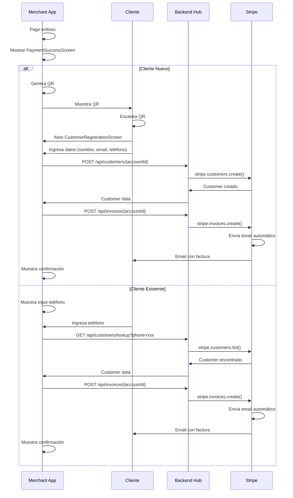

# Flujo de Facturación Post-Pago con QR y Customer Stripe

## 📋 Overview

Este documento describe el flujo completo de captura de datos del cliente y generación de facturas después de un pago exitoso en Jeturing Pay.

## 🎯 Objetivo

Después de cada pago exitoso:
1. Capturar datos del cliente (teléfono, correo, nombre)
2. Crear un Customer en Stripe
3. Generar y enviar factura automáticamente
4. Diferenciar entre clientes nuevos y existentes

## 🔄 Flujos Implementados

### Flujo 1: Cliente Nuevo (con QR)

```
Pago Exitoso
    ↓
PaymentSuccessScreen
    ↓
[Opción: Cliente Nuevo]
    ↓
Genera QR Code
    ↓
Cliente escanea QR
    ↓
CustomerRegistrationScreen (web/app)
    ↓
Cliente ingresa:
  - Nombre completo
  - Email
  - Teléfono
    ↓
POST /api/customers/{accountId}
  → Crea Stripe Customer
    ↓
POST /api/invoices/{accountId}
  → Genera factura
  → Envía email automático
    ↓
✅ Cliente recibe factura por email
```

### Flujo 2: Cliente Existente (por teléfono)

```
Pago Exitoso
    ↓
PaymentSuccessScreen
    ↓
[Opción: Cliente Existente]
    ↓
Input: Número de teléfono
    ↓
GET /api/customers/lookup?phone={phone}
  → Busca Customer existente
    ↓
¿Existe?
  ├─ SÍ → POST /api/invoices/{accountId}
  │        → Genera factura
  │        → Envía a email asociado
  │        ↓
  │       ✅ Factura enviada
  │
  └─ NO → "Cliente no encontrado"
          → Opción: Registrar como nuevo
```

## 📱 Pantallas Implementadas

### 1. PaymentSuccessScreen

**Ubicación**: `src/screens/PaymentSuccessScreen.tsx`

**Funcionalidad**:
- Muestra animación de éxito con Lottie
- Presenta dos opciones:
  - 📱 **Cliente Nuevo**: Genera QR para registro
  - 👤 **Cliente Existente**: Input de teléfono
- Permite omitir el proceso

**Props recibidos** (via navigation):
```typescript
{
  paymentIntentId: string;  // ID del pago exitoso
  amount: number;           // Monto en centavos
  currency: string;         // 'USD', etc.
}
```

**Componentes clave**:
- QR Code generation con `react-native-qrcode-svg`
- Input de teléfono con validación
- Integración con `customer.ts` service

### 2. CustomerRegistrationScreen

**Ubicación**: `src/screens/CustomerRegistrationScreen.tsx`

**Funcionalidad**:
- Formulario de registro del cliente
- Validación de email y teléfono
- Crea Customer en Stripe
- Genera y envía factura automáticamente

**Props recibidos** (via deep link / QR):
```typescript
{
  payment_intent: string;   // ID del pago
  account: string;          // ID cuenta conectada
  amount: string;           // Monto en centavos
}
```

**Flow interno**:
1. Cliente completa formulario
2. `createCustomer()` → Crea Stripe Customer
3. `generateInvoice()` → Genera factura asociada al pago
4. Muestra confirmación con animación
5. Cliente recibe email automáticamente

## 🔧 Servicios Implementados

### customer.ts

**Ubicación**: `src/services/customer.ts`

**Métodos principales**:

#### 1. `lookupCustomerByPhone()`
```typescript
lookupCustomerByPhone(phone: string, accountId: string): Promise<CustomerLookup>
```
- Busca customer existente por teléfono
- Retorna `{ exists: boolean, customer?: Customer }`

#### 2. `createCustomer()`
```typescript
createCustomer(
  email: string,
  phone: string,
  name: string,
  accountId: string,
  metadata?: Record<string, string>
): Promise<Customer>
```
- Crea nuevo Stripe Customer
- Asociado a la cuenta conectada
- Incluye metadata del pago

#### 3. `generateInvoice()`
```typescript
generateInvoice(
  paymentIntentId: string,
  customerId: string,
  accountId: string
): Promise<InvoiceData>
```
- Genera factura para el pago
- Vincula Customer con PaymentIntent
- Envía email automáticamente (`auto_send_email: true`)

#### 4. `generateCustomerRegistrationQR()`
```typescript
generateCustomerRegistrationQR(
  paymentIntentId: string,
  accountId: string,
  amount: number
): string
```
- Genera URL para deep link
- Formato: `https://pay.jeturing.com/customer-register?payment_intent=xxx&account=yyy&amount=zzz`
- Esta URL se convierte en QR Code

#### 5. `sendInvoiceToCustomer()`
```typescript
sendInvoiceToCustomer(
  paymentIntentId: string,
  phone: string,
  accountId: string
): Promise<boolean>
```
- Flujo completo para cliente existente
- Lookup + Generate + Send invoice

## 🌐 Backend Endpoints Requeridos

### 1. Lookup Customer
```http
GET /api/customers/lookup?phone={phone}
Headers: Stripe-Account: {accountId}

Response:
{
  "exists": true,
  "customer": {
    "id": "cus_xxx",
    "email": "cliente@example.com",
    "phone": "+1234567890",
    "name": "Juan Pérez"
  }
}
```

### 2. Create Customer
```http
POST /api/customers/{accountId}
Headers: Stripe-Account: {accountId}
Body:
{
  "email": "nuevo@example.com",
  "phone": "+1234567890",
  "name": "María López",
  "metadata": {
    "source": "jeturing_pay_mobile",
    "payment_intent": "pi_xxx",
    "amount": "1000"
  }
}

Response:
{
  "id": "cus_xxx",
  "email": "nuevo@example.com",
  "phone": "+1234567890",
  "name": "María López",
  "metadata": {...}
}
```

### 3. Generate Invoice
```http
POST /api/invoices/{accountId}
Headers: Stripe-Account: {accountId}
Body:
{
  "payment_intent": "pi_xxx",
  "customer": "cus_xxx",
  "auto_send_email": true
}

Response:
{
  "id": "in_xxx",
  "pdf_url": "https://invoice.stripe.com/...",
  "customer_email": "cliente@example.com",
  "amount": 1000,
  "status": "paid"
}
```

## 🔐 Implementación Backend (Node.js)

### Lookup Customer
```javascript
app.get('/api/customers/lookup', async (req, res) => {
  const { phone } = req.query;
  const accountId = req.headers['stripe-account'];

  try {
    const customers = await stripe.customers.list({
      limit: 1,
      email: phone // or use metadata search
    }, {
      stripeAccount: accountId
    });

    if (customers.data.length > 0) {
      res.json({
        exists: true,
        customer: customers.data[0]
      });
    } else {
      res.json({ exists: false });
    }
  } catch (error) {
    res.status(500).json({ error: error.message });
  }
});
```

### Create Customer
```javascript
app.post('/api/customers/:accountId', async (req, res) => {
  const { accountId } = req.params;
  const { email, phone, name, metadata } = req.body;

  try {
    const customer = await stripe.customers.create({
      email,
      phone,
      name,
      metadata
    }, {
      stripeAccount: accountId
    });

    res.json(customer);
  } catch (error) {
    res.status(400).json({ error: error.message });
  }
});
```

### Generate Invoice
```javascript
app.post('/api/invoices/:accountId', async (req, res) => {
  const { accountId } = req.params;
  const { payment_intent, customer, auto_send_email } = req.body;

  try {
    // Get payment intent details
    const intent = await stripe.paymentIntents.retrieve(payment_intent, {
      stripeAccount: accountId
    });

    // Create invoice
    const invoice = await stripe.invoices.create({
      customer,
      auto_advance: true,
      collection_method: 'charge_automatically',
      metadata: {
        payment_intent,
        amount: intent.amount
      }
    }, {
      stripeAccount: accountId
    });

    // Add invoice item
    await stripe.invoiceItems.create({
      customer,
      invoice: invoice.id,
      amount: intent.amount,
      currency: intent.currency,
      description: 'Pago Jeturing Pay'
    }, {
      stripeAccount: accountId
    });

    // Finalize and send
    const finalizedInvoice = await stripe.invoices.finalizeInvoice(
      invoice.id,
      { auto_advance: true },
      { stripeAccount: accountId }
    );

    if (auto_send_email) {
      await stripe.invoices.sendInvoice(invoice.id, {
        stripeAccount: accountId
      });
    }

    res.json({
      id: finalizedInvoice.id,
      pdf_url: finalizedInvoice.invoice_pdf,
      customer_email: finalizedInvoice.customer_email,
      amount: finalizedInvoice.amount_paid,
      status: finalizedInvoice.status
    });
  } catch (error) {
    res.status(400).json({ error: error.message });
  }
});
```

## 📊 Diagrama de Secuencia



## ✅ Checklist de Implementación

- [x] Service `customer.ts` con todos los métodos
- [x] Screen `PaymentSuccessScreen` con opciones
- [x] Screen `CustomerRegistrationScreen` con formulario
- [x] QR Code generation con `react-native-qrcode-svg`
- [x] Integración con navegación
- [x] Animaciones Lottie para feedback
- [ ] Backend endpoints (pendiente deployment)
- [ ] Deep linking configuration
- [ ] Email templates en Stripe
- [ ] Testing end-to-end

## 🚀 Próximos Pasos

1. **Deploy Backend Hub** con los 3 endpoints
2. **Configurar Deep Links** en app.json y backend
3. **Personalizar Email Templates** en Stripe Dashboard
4. **Testing**:
   - Flujo completo cliente nuevo
   - Flujo completo cliente existente
   - Validaciones y errores
5. **Documentar** para merchants

## 💡 Consideraciones

### Seguridad
- Validar todos los inputs del cliente
- Verificar ownership del payment_intent antes de crear invoice
- Rate limiting en lookup endpoint

### UX
- Mostrar preview de la factura antes de enviar
- Permitir regenerar QR si cliente lo necesita
- Timeout del QR después de X minutos

### Datos
- Almacenar relación payment_intent ↔ customer en metadata
- Permitir búsqueda de customers por múltiples campos
- Implementar caché para lookups frecuentes

---

**Última actualización**: Diciembre 22, 2025
**Versión**: 1.0.0
**Estado**: ✅ Frontend completo, ⏳ Backend pendiente
