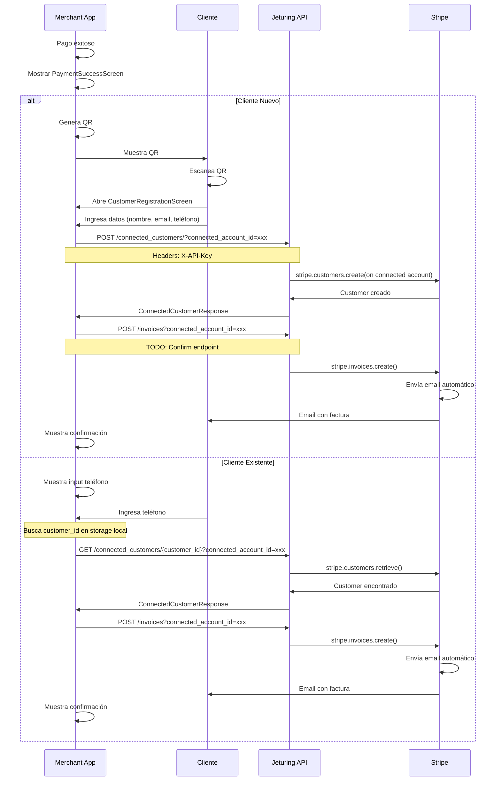

# Flujo de Facturación Post-Pago con QR y Customer Stripe

## 📋 Overview

Este documento describe el flujo completo de captura de datos del cliente y generación de facturas después de un pago exitoso en Jeturing Pay.

## 🎯 Objetivo

Después de cada pago exitoso:
1. Capturar datos del cliente (teléfono, correo, nombre)
2. Crear un Customer en Stripe
3. Generar y enviar factura automáticamente
4. Diferenciar entre clientes nuevos y existentes

## 🔄 Flujos Implementados

### Flujo 1: Cliente Nuevo (con QR)

```
Pago Exitoso
    ↓
PaymentSuccessScreen
    ↓
[Opción: Cliente Nuevo]
    ↓
Genera QR Code
    ↓
Cliente escanea QR
    ↓
CustomerRegistrationScreen (web/app)
    ↓
Cliente ingresa:
  - Nombre completo
  - Email
  - Teléfono
    ↓
POST /api/customers/{accountId}
  → Crea Stripe Customer
    ↓
POST /api/invoices/{accountId}
  → Genera factura
  → Envía email automático
    ↓
✅ Cliente recibe factura por email
```

### Flujo 2: Cliente Existente (por teléfono)

```
Pago Exitoso
    ↓
PaymentSuccessScreen
    ↓
[Opción: Cliente Existente]
    ↓
Input: Número de teléfono
    ↓
GET /api/customers/lookup?phone={phone}
  → Busca Customer existente
    ↓
¿Existe?
  ├─ SÍ → POST /api/invoices/{accountId}
  │        → Genera factura
  │        → Envía a email asociado
  │        ↓
  │       ✅ Factura enviada
  │
  └─ NO → "Cliente no encontrado"
          → Opción: Registrar como nuevo
```

## 📱 Pantallas Implementadas

### 1. PaymentSuccessScreen

**Ubicación**: `src/screens/PaymentSuccessScreen.tsx`

**Funcionalidad**:
- Muestra animación de éxito con Lottie
- Presenta dos opciones:
  - 📱 **Cliente Nuevo**: Genera QR para registro
  - 👤 **Cliente Existente**: Input de teléfono
- Permite omitir el proceso

**Props recibidos** (via navigation):
```typescript
{
  paymentIntentId: string;  // ID del pago exitoso
  amount: number;           // Monto en centavos
  currency: string;         // 'USD', etc.
}
```

**Componentes clave**:
- QR Code generation con `react-native-qrcode-svg`
- Input de teléfono con validación
- Integración con `customer.ts` service

### 2. CustomerRegistrationScreen

**Ubicación**: `src/screens/CustomerRegistrationScreen.tsx`

**Funcionalidad**:
- Formulario de registro del cliente
- Validación de email y teléfono
- Crea Customer en Stripe
- Genera y envía factura automáticamente

**Props recibidos** (via deep link / QR):
```typescript
{
  payment_intent: string;   // ID del pago
  account: string;          // ID cuenta conectada
  amount: string;           // Monto en centavos
}
```

**Flow interno**:
1. Cliente completa formulario
2. `createCustomer()` → Crea Stripe Customer
3. `generateInvoice()` → Genera factura asociada al pago
4. Muestra confirmación con animación
5. Cliente recibe email automáticamente

## 🔧 Servicios Implementados

### customer.ts

**Ubicación**: `src/services/customer.ts`

**Métodos principales**:

#### 1. `lookupCustomerByPhone()`
```typescript
lookupCustomerByPhone(phone: string, accountId: string): Promise<CustomerLookup>
```
- Busca customer existente por teléfono
- Retorna `{ exists: boolean, customer?: Customer }`

#### 2. `createCustomer()`
```typescript
createCustomer(
  email: string,
  phone: string,
  name: string,
  accountId: string,
  metadata?: Record<string, string>
): Promise<Customer>
```
- Crea nuevo Stripe Customer
- Asociado a la cuenta conectada
- Incluye metadata del pago

#### 3. `generateInvoice()`
```typescript
generateInvoice(
  paymentIntentId: string,
  customerId: string,
  accountId: string
): Promise<InvoiceData>
```
- Genera factura para el pago
- Vincula Customer con PaymentIntent
- Envía email automáticamente (`auto_send_email: true`)

#### 4. `generateCustomerRegistrationQR()`
```typescript
generateCustomerRegistrationQR(
  paymentIntentId: string,
  accountId: string,
  amount: number
): string
```
- Genera URL para deep link
- Formato: `https://pay.jeturing.com/customer-register?payment_intent=xxx&account=yyy&amount=zzz`
- Esta URL se convierte en QR Code

#### 5. `sendInvoiceToCustomer()`
```typescript
sendInvoiceToCustomer(
  paymentIntentId: string,
  phone: string,
  accountId: string
): Promise<boolean>
```
- Flujo completo para cliente existente
- Lookup + Generate + Send invoice

## 🌐 Backend Endpoints Requeridos

### Usando Jeturing API v2.5.0

**Base URL**: `https://api.jeturing.com`

**Authentication**: `X-API-Key` header required

### 1. Create Customer (✅ Available)
```http
POST /connected_customers/
Query Params: connected_account_id={accountId}
Headers: X-API-Key: {api_key}
Body:
{
  "email": "nuevo@example.com",
  "phone": "+1234567890",
  "name": "María López",
  "metadata": {
    "source": "jeturing_pay_mobile",
    "payment_intent": "pi_xxx",
    "amount": "1000"
  }
}

Response:
{
  "id": "cus_xxx",
  "email": "nuevo@example.com",
  "phone": "+1234567890",
  "name": "María López",
  "metadata": {...},
  "created": 1234567890,
  "livemode": false
}
```

### 2. Get Customer (✅ Available)
```http
GET /connected_customers/{customer_id}
Query Params: connected_account_id={accountId}
Headers: X-API-Key: {api_key}

Response:
{
  "id": "cus_xxx",
  "email": "cliente@example.com",
  "phone": "+1234567890",
  "name": "Juan Pérez",
  "metadata": {...}
}
```

### 3. Update Customer (✅ Available)
```http
PUT /connected_customers/{customer_id}
Query Params: connected_account_id={accountId}
Headers: X-API-Key: {api_key}
Body:
{
  "email": "updated@example.com",
  "phone": "+0987654321",
  "metadata": {...}
}
```

### 4. Lookup Customer (⚠️ Not Available - Workaround Needed)
```http
# Current: No direct phone lookup endpoint
# Workaround: Store customer_id → phone mapping locally
# OR: Request Jeturing team to add search endpoint
```

### 5. Generate Invoice (⏳ Pending Confirmation)
```http
POST /invoices
Query Params: connected_account_id={accountId}
Headers: X-API-Key: {api_key}
Body:
{
  "payment_intent": "pi_xxx",
  "customer": "cus_xxx",
  "auto_send_email": true
}

# TODO: Confirm endpoint path and structure with Jeturing team
```

## 🔐 Implementation Notes

### Using Jeturing API

The app now uses the actual Jeturing API (v2.5.0) instead of hypothetical endpoints.

**Key Changes:**
1. ✅ Customer creation via `POST /connected_customers/`
2. ✅ Customer retrieval via `GET /connected_customers/{customer_id}`
3. ✅ Customer update via `PUT /connected_customers/{customer_id}`
4. ✅ Uses `connected_account_id` as query parameter
5. ✅ Uses `X-API-Key` header for authentication
6. ⚠️ Phone lookup requires workaround (no direct endpoint)
7. ⏳ Invoice generation endpoint pending confirmation

### API Key Configuration

The app requires configuration of the Jeturing API key:

```typescript
import { setApiKey } from './services/customer';

// During app initialization or onboarding
await setApiKey('your_jeturing_api_key_here');
```

### Customer Lookup Workaround

Since Jeturing API doesn't have a direct phone lookup endpoint, implement one of these strategies:

**Option 1: Local Storage Mapping**
```typescript
// Store customer_id when creating customer
await AsyncStorage.setItem(
  `customer_phone_${phone}`,
  customer.id
);

// Retrieve when looking up
const customerId = await AsyncStorage.getItem(
  `customer_phone_${phone}`
);
if (customerId) {
  const customer = await getCustomerById(customerId, accountId);
}
```

**Option 2: Request New Endpoint**
Ask Jeturing team to add:
```http
GET /connected_customers/search
Query Params: 
  - connected_account_id={accountId}
  - phone={phone}
Headers: X-API-Key: {api_key}
```

**Option 3: Use Metadata Search**
Store phone in metadata and implement server-side search.

## 📊 Diagrama de Secuencia



## ✅ Checklist de Implementación

- [x] Service `customer.ts` con métodos actualizados para Jeturing API
- [x] Screen `PaymentSuccessScreen` con opciones
- [x] Screen `CustomerRegistrationScreen` con formulario
- [x] QR Code generation con `react-native-qrcode-svg`
- [x] Integración con navegación
- [x] Animaciones Lottie para feedback
- [x] Actualizado para usar `POST /connected_customers/`
- [x] Actualizado para usar query params (`connected_account_id`)
- [x] Actualizado para usar `X-API-Key` header
- [x] API Key management con AsyncStorage
- [x] Validación de errores 422
- [ ] Testing con Jeturing API real
- [ ] Confirmar endpoint de invoices
- [ ] Implementar workaround para phone lookup
- [ ] Deep linking configuration
- [ ] Email templates en Stripe

## 🚀 Próximos Pasos

1. **Configurar API Key** en la app
2. **Testing con Jeturing API** endpoints reales
3. **Confirmar Invoice Endpoint** con equipo Jeturing
4. **Implementar Phone Lookup** workaround (local storage o nuevo endpoint)
5. **Configurar Deep Links** en app.json y backend
6. **Personalizar Email Templates** en Stripe Dashboard
7. **Testing End-to-End**

## 💡 Consideraciones

### API Key
- Debe configurarse durante onboarding o en settings
- Se almacena de forma segura en AsyncStorage
- En producción, considerar encriptación adicional

### Phone Lookup
- Jeturing API no tiene endpoint directo
- Opciones:
  1. Almacenar mapping local (customer_id ↔ phone)
  2. Solicitar nuevo endpoint `/connected_customers/search`
  3. Usar metadata y búsqueda en servidor

### Invoices
- Endpoint pendiente de confirmación
- Verificar estructura de request/response
- Confirmar si auto-envía email

---

**Última actualización**: Diciembre 22, 2025
**Versión**: 2.0.0 (Actualizado para Jeturing API v2.5.0)
**Estado**: ✅ Integrado con Jeturing API, ⏳ Testing pendiente
