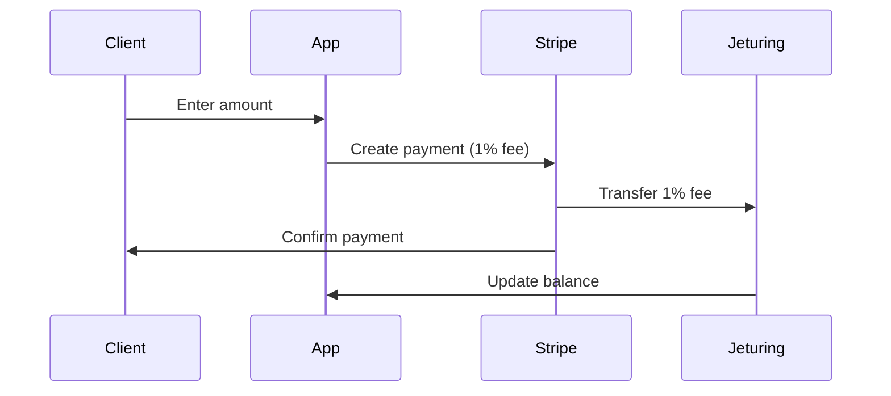
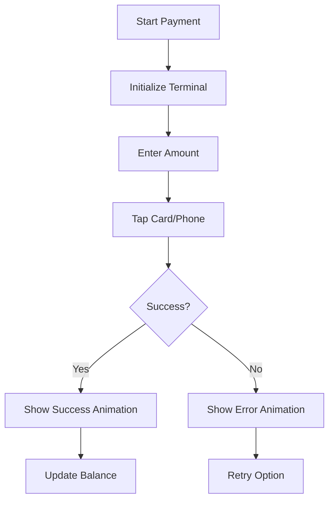
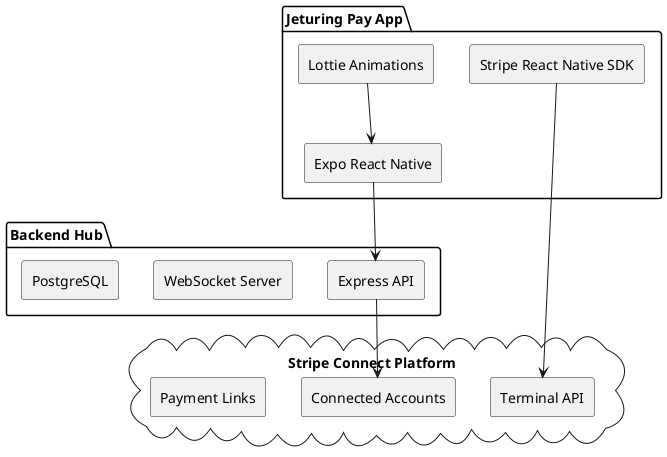

# Jeturing Pay - Expo React Native Implementation Guide

## 🎯 Project Overview

Jeturing Pay is a cross-platform mobile payment application built with Expo and React Native, featuring:
- **Lottie animations** for smooth, dynamic UI feedback
- **Stripe Connect** with automatic 1% platform fees for Jeturing
- **Tap to Pay** for NFC-based contactless payments
- **Payment links** for remote payment collection
- **Automatic documentation** generation

## 📋 Implementation Status

### ✅ Phase 1: Foundation (COMPLETE)
- Project structure with Expo
- 4 Lottie animations (JSON)
- Stripe Connect service with 1% fee
- Tap to Pay hook
- Payment link generation
- TypeScript configuration
- EAS Build setup

### 🔄 Phase 2: UI Screens (IN PROGRESS)

Need to create the following screens:

#### 1. Onboarding Screen
**File**: `src/screens/OnboardingScreen.tsx`
- Use `onboarding.json` Lottie animation
- Explain Jeturing Pay features
- 3-4 swipeable slides
- "Get Started" button

#### 2. Registration Screen  
**File**: `src/screens/RegistrationScreen.tsx`
- Business name input
- Email input
- Phone input
- Terms & conditions checkbox
- Creates Stripe Connected Account on submit
- Shows `loading-spin.json` during registration
- Shows `payment-success.json` on success
- Shows `error-shake.json` on error

#### 3. Home/Dashboard Screen
**File**: `src/screens/HomeScreen.tsx`
- Quick payment options
- Recent transactions list
- Account balance (with Jeturing 1% fee breakdown)
- Navigation to:
  - Tap to Pay
  - Payment Links
  - Transaction History
  - Settings

#### 4. Tap to Pay Screen
**File**: `src/screens/TapToPayScreen.tsx`
- Amount input with number pad
- "Start Payment" button
- NFC animation while processing
- Success/error feedback with Lottie
- Uses `useTapToPay` hook

#### 5. Payment Link Screen
**File**: `src/screens/PaymentLinkScreen.tsx`
- Amount input
- Description (optional)
- "Generate Link" button
- Share options (SMS, Email, WhatsApp, Copy)
- QR code display
- Uses `usePaymentLink` hook

#### 6. Transaction History Screen
**File**: `src/screens/TransactionHistoryScreen.tsx`
- List of all transactions
- Filter by status, date
- Show Jeturing fee per transaction
- Pull to refresh
- Detail view on tap

### 🔄 Phase 3: Additional Components

#### 1. Amount Input Component
**File**: `src/components/AmountInput.tsx`
```typescript
interface AmountInputProps {
  value: number;
  onChange: (amount: number) => void;
  currency?: string;
  maxAmount?: number;
}
```
- Custom number pad
- Currency formatting
- Validation

#### 2. Payment Method Selector
**File**: `src/components/PaymentMethodSelector.tsx`
- Cards for each payment method:
  - Tap to Pay (NFC icon)
  - Payment Link (Link icon)
  - Pinpad (Device icon)
- Animated selection

#### 3. Transaction Card
**File**: `src/components/TransactionCard.tsx`
- Shows transaction details
- Status badge
- Amount with fee breakdown
- Date/time
- Tap for details

#### 4. Fee Breakdown Modal
**File**: `src/components/FeeBreakdownModal.tsx`
- Shows:
  - Total amount
  - Jeturing fee (1%)
  - Merchant receives
  - Stripe processing fee
- Visual chart

### 🔄 Phase 4: Backend Hub Implementation

Create Node.js backend at `backend/`:

#### Required Endpoints

**1. Connected Account Management**
```
POST /api/stripe/connect
- Create new connected account
- Body: { email, business_name, metadata }
- Returns: { id, charges_enabled, payouts_enabled }
```

**2. Connection Token (for Tap to Pay)**
```
GET /api/terminal/token/:accountId
- Generate terminal connection token
- Scoped to connected account
- Returns: { secret }
```

**3. Payment Intent Creation**
```
POST /api/payments/:accountId
- Create payment intent with 1% fee
- Body: { amount, currency, application_fee_amount }
- Returns: { id, client_secret, amount, application_fee_amount }
```

**4. Payment Link Creation**
```
POST /api/payment-links/:accountId
- Create shareable payment link
- Body: { amount, currency, description, application_fee_amount }
- Returns: { id, url, amount, active }
```

**5. Refund Processing**
```
POST /api/refunds/:accountId
- Process refund with fee reversal
- Body: { payment_intent, amount?, reverse_transfer }
- Returns: { id, amount, status }
```

**6. Account Summary**
```
GET /api/accounts/:accountId/summary
- Get balance and transaction summary
- Returns: { balance, fees_collected, pending_balance }
```

**7. Webhook Handler**
```
POST /api/webhooks/stripe
- Handle Stripe events
- payment_intent.succeeded
- payment_intent.payment_failed
- charge.refunded
- account.updated
```

#### Backend Technology Stack
```javascript
// package.json for backend
{
  "dependencies": {
    "express": "^4.18.0",
    "stripe": "^14.0.0",
    "body-parser": "^1.20.0",
    "cors": "^2.8.5",
    "dotenv": "^16.0.0",
    "ws": "^8.14.0",  // WebSocket for real-time
    "pg": "^8.11.0"    // PostgreSQL
  }
}
```

### 🔄 Phase 5: Documentation Generation

#### 1. TypeDoc Configuration
**File**: `typedoc.json`
```json
{
  "entryPoints": ["src"],
  "out": "docs/api-reference",
  "excludePrivate": true,
  "excludeProtected": true,
  "theme": "default"
}
```

Run: `npm run docs:generate`

#### 2. Mermaid Diagrams
**File**: `docs/flows/payment-flow.md`


**File**: `docs/flows/tap-to-pay-flow.md`


#### 3. PlantUML Diagrams
**File**: `docs/diagrams/architecture.puml`


#### 4. Auto-generation Script
**File**: `scripts/generate-diagrams.js`
```javascript
const { execSync } = require('child_process');
const fs = require('fs');

// Generate Mermaid diagrams
console.log('Generating Mermaid diagrams...');
execSync('mmdc -i docs/flows/payment-flow.md -o docs/diagrams/payment-flow.png');

// Generate PlantUML diagrams
console.log('Generating PlantUML diagrams...');
execSync('puml generate docs/diagrams/*.puml');

console.log('Documentation generated successfully!');
```

### 🔄 Phase 6: Navigation Setup

**File**: `App.tsx`
```typescript
import { NavigationContainer } from '@react-navigation/native';
import { createStackNavigator } from '@react-navigation/stack';
import { StripeProvider } from '@stripe/stripe-react-native';

const Stack = createStackNavigator();

export default function App() {
  return (
    <StripeProvider publishableKey="pk_live_jeturing">
      <NavigationContainer>
        <Stack.Navigator initialRouteName="Onboarding">
          <Stack.Screen name="Onboarding" component={OnboardingScreen} />
          <Stack.Screen name="Registration" component={RegistrationScreen} />
          <Stack.Screen name="Home" component={HomeScreen} />
          <Stack.Screen name="TapToPay" component={TapToPayScreen} />
          <Stack.Screen name="PaymentLink" component={PaymentLinkScreen} />
          <Stack.Screen name="History" component={TransactionHistoryScreen} />
        </Stack.Navigator>
      </NavigationContainer>
    </StripeProvider>
  );
}
```

### 🔄 Phase 7: Testing & Build

#### 1. Unit Tests
**Directory**: `__tests__/`
- Test hooks (useTapToPay, usePaymentLink)
- Test services (stripe.ts)
- Test utilities (lottieLoader.ts)

#### 2. Integration Tests
- Test complete payment flows
- Test refund process
- Test error handling

#### 3. E2E Tests
- Use Detox or Maestro
- Test user journeys

#### 4. Build Commands
```bash
# Development build
eas build --profile development --platform all

# Preview build
eas build --profile preview --platform all

# Production build
eas build --profile production --platform all

# Submit to stores
eas submit --platform ios
eas submit --platform android
```

## 🚀 Quick Start Guide

### 1. Install Dependencies
```bash
cd JeturingApp
npm install
```

### 2. Start Development Server
```bash
npx expo start
```

### 3. Run on Device
```bash
# iOS
npx expo start --ios

# Android
npx expo start --android
```

### 4. Generate Documentation
```bash
npm run docs
```

### 5. Build for Production
```bash
npm run build:all
```

## 📊 Progress Tracking

- [x] Phase 1: Foundation (100%)
- [ ] Phase 2: UI Screens (0%)
- [ ] Phase 3: Components (0%)
- [ ] Phase 4: Backend Hub (0%)
- [ ] Phase 5: Documentation (50% - configs ready)
- [ ] Phase 6: Navigation (0%)
- [ ] Phase 7: Testing & Build (0%)

**Overall Progress: 20%**

## 🎯 Next Immediate Steps

1. **Create App.tsx** with navigation
2. **Implement OnboardingScreen** with Lottie
3. **Implement RegistrationScreen** with Stripe Connect
4. **Create HomeScreen** with dashboard
5. **Deploy Backend Hub** to production
6. **Test end-to-end flow**

## 📞 Support

For questions or issues:
- Check documentation in `docs/`
- Review code examples in `src/`
- Contact Jeturing development team

---

**Last Updated**: December 22, 2025
**Version**: 1.0.0-alpha
**Status**: Foundation Complete, UI Implementation Ready
