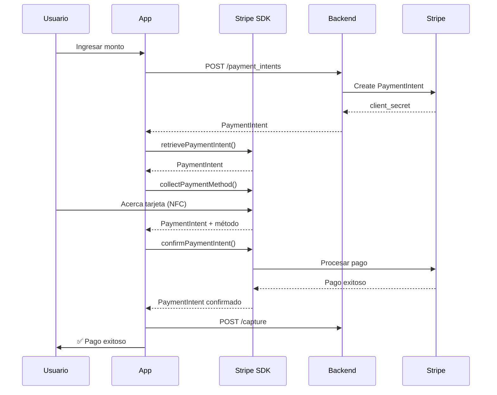

# Jeturing Pay - WisePOS E Native App

<div align="center">
  
  
  **Aplicación nativa Android para WisePOS E**
  
  Procesamiento de pagos con Stripe Terminal SDK directamente en el dispositivo
</div>

---

## 🎨 Branding

### Logo
El logo de Jeturing Pay representa:
- **Círculo**: Ciclo completo de pago, confianza y seguridad
- **Tarjeta**: Métodos de pago (chip, NFC, banda magnética)
- **Flecha**: Transacción rápida y fluida
- **Colores**: 
  - Verde azulado (`#00A896`): Innovación y confianza
  - Azul profundo (`#0080A8`): Seguridad y profesionalismo

### Paleta de colores
```kotlin
// Primary Colors
primary: #6772E5 (Stripe Blue)
primary_dark: #5469D4
primary_light: #7795F8

// Jeturing Brand
jeturing_teal: #00A896
jeturing_blue: #0080A8

// Status Colors
success_green: #32D583
warning_orange: #FFA500
error_red: #E25950
```

---

## 📱 Características

- ✅ **Interfaz nativa optimizada** para WisePOS E
- ✅ **Stripe Terminal SDK v4.7.3** con soporte Apps on Device
- ✅ **Procesamiento de pagos** con NFC, chip y banda magnética
- ✅ **Animaciones Lottie** para experiencia premium
- ✅ **Historial de transacciones** con búsqueda y filtros
- ✅ **Conexión al backend** Jeturing en tiempo real
- ✅ **Splash screen** con logo animado

---

## 🏗️ Arquitectura

```
WisePosApp/
├── app/
│   ├── src/main/
│   │   ├── java/com/jeturing/pay/terminal/
│   │   │   ├── MainActivity.kt              # Pantalla principal
│   │   │   ├── PaymentActivity.kt           # Flujo de cobro
│   │   │   ├── HistoryActivity.kt           # Historial
│   │   │   ├── JeturingPayApp.kt            # Application class
│   │   │   ├── network/
│   │   │   │   └── ApiClient.kt             # Cliente REST
│   │   │   └── service/
│   │   │       └── TerminalHandoffService.kt
│   │   └── res/
│   │       ├── drawable/
│   │       │   ├── logo_jeturing_pay.xml    # Logo vectorial
│   │       │   └── ic_launcher_foreground.xml
│   │       ├── layout/                       # UI layouts
│   │       ├── raw/                          # Animaciones Lottie
│   │       └── values/
│   │           ├── colors.xml
│   │           ├── strings.xml
│   │           └── themes.xml
│   └── build.gradle.kts
└── gradle/
```

---

## 🚀 Compilar

### Requisitos
- Android Studio Arctic Fox o superior
- JDK 11+
- Android SDK 26+ (Android 8.0)
- Gradle 8.12.1

### Build Debug
```bash
cd WisePosApp
./gradlew clean assembleDebug
```

El APK se genera en:
```
app/build/outputs/apk/debug/app-debug.apk
```

### Build Release
```bash
./gradlew assembleRelease
```

---

## 📦 Desplegar al WisePOS E

### Opción 1: Stripe Apps on Device (Recomendado)
1. Contacta a Stripe Support para habilitar el programa
2. Sube el APK firmado al Dashboard de Stripe
3. Despliega desde el Dashboard a tus dispositivos

### Opción 2: ADB (Desarrollo)
```bash
# Conectar al dispositivo
adb connect 192.168.2.225

# Instalar APK
adb install -r app-debug.apk
```

### Opción 3: MDM del proveedor
Si tienes un sistema MDM configurado por tu proveedor de WisePOS E.

---

## 🔧 Configuración

### Backend API
Configurado en `build.gradle.kts`:
```kotlin
buildConfigField("String", "BACKEND_URL", "\"https://api-001.sajet.us\"")
```

### API Key
En `ApiClient.kt`:
```kotlin
private const val API_KEY = "*963.Abcd"
```

### Cuenta Stripe
- **Account ID**: `acct_1G0K5CB1h7Ho0bBU` (JETURING, Inc.)
- **Test Key**: `sk_test_51G0K5CB1h7Ho0bBU...`

---

## 🎯 Flujo de pagos



---

## 📸 Screenshots

### Pantalla principal
- Logo de Jeturing Pay
- Estado de conexión del terminal
- Botones de acción (Nuevo cobro, Historial, Configuración)

### Pantalla de cobro
- Animación Lottie de tap de tarjeta
- Monto y descripción
- Barra de progreso
- Feedback visual en tiempo real

### Historial
- Lista de transacciones
- Pull-to-refresh
- Filtros por fecha/monto

---

## 🐛 Troubleshooting

### Error: SDK location not found
```bash
echo "sdk.dir=/Users/$(whoami)/Library/Android/sdk" > local.properties
```

### Error: Connection token failed
Verifica que el backend esté corriendo y accesible:
```bash
curl -H "x-api-key: *963.Abcd" https://api-001.sajet.us/stripe/terminal/connection_token
```

### Error: Terminal not initialized
Asegúrate de que la app tenga permisos de Internet y ubicación en el WisePOS E.

---

## 📄 Licencia

Copyright © 2025 Jeturing, Inc.
Todos los derechos reservados.

---

## 🤝 Soporte

- **Email**: support@jeturing.com
- **Dashboard**: https://dashboard.render.com/blueprint/exs-d54elb8gjchc73fqqhsg
- **Stripe Dashboard**: https://dashboard.stripe.com

---

<div align="center">
  Hecho con ❤️ por el equipo de Jeturing
</div>
